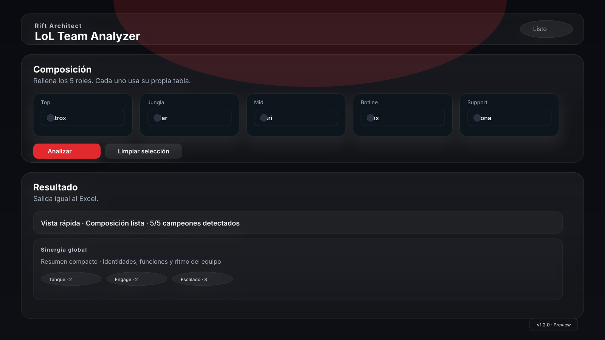
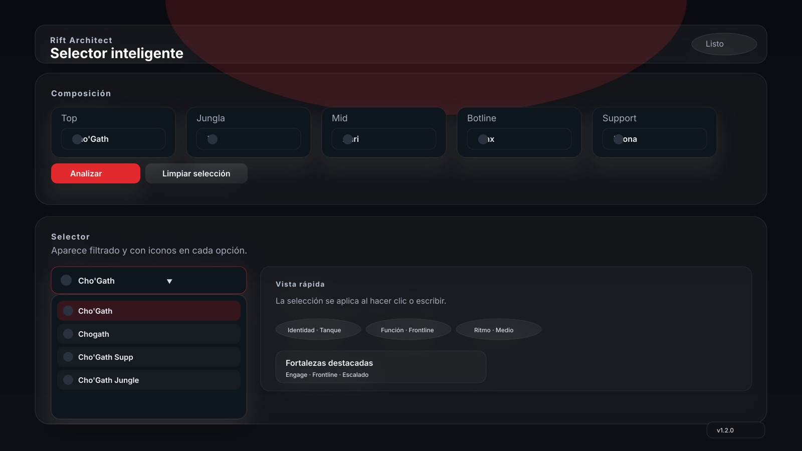

# LoL Team Analyzer

Mini PWA para reproducir la pestaña **Composición** del Excel del repositorio directamente en la interfaz.

## Estado actual

- Versión visible: `v1.2.0`
- Fuente de verdad: `Draft Pool.xlsx`
- La app lee el Excel directamente en el navegador.
- La salida reproduce las columnas de la hoja **Composición**.
- Cada rol usa su propia lista de campeones desde su hoja del Excel.
- No permite campeones repetidos.
- Muestra iconos oficiales de los campeones cuando están disponibles.
- El selector, la vista rápida y el resultado se actualizan sin recargar.

## Capturas

[](docs/capturas/vista-principal.svg)

[](docs/capturas/selector-abierto.svg)

Las dos imágenes son capturas de referencia de la interfaz actual.

## Estructura del proyecto

- `index.html`: estructura principal de la app.
- `style.css`: base visual general.
- `stage3-spacing.css`, `stage3-visual.css`, `stage3-animations.css`: ajustes de espaciado, acabado visual y animaciones.
- `app.js`: lectura del Excel, selector, validaciones y render de la composición.
- `shared-utils.js`: utilidades compartidas de normalización, escape y listas.
- `smart-search.js`: búsqueda inteligente en el selector.
- `no-duplicate-options.js`: oculta campeones ya seleccionados.
- `selected-preview.js`: muestra el campeón seleccionado dentro del input.
- `menu-icons.js`: añade iconos al desplegable.
- `realtime-mode.js`: actualiza el resultado al escribir.
- `result-summary.js`: resumen rápido del resultado.
- `result-summary.css`: estilos del resumen rápido.
- `version.json` y `version.js`: badge visible y panel de versión.
- `sw.js`: caché offline de los assets públicos.
- `Draft Pool.xlsx`: fuente de verdad de la app.
- `docs/arquitectura.md`: arquitectura y flujo de datos.
- `docs/ux-audit.md`: auditoría de UX.

## Flujo de datos

1. `app.js` carga `Draft Pool.xlsx` desde GitHub Raw y, si hace falta, desde la ruta local.
2. Se extraen las hojas por rol: `Tabla Top`, `Tabla Jungla`, `Tabla Mid`, `Tabla Botline` y `Tabla Support`.
3. El selector muestra solo los campeones válidos de cada rol.
4. Al seleccionar campeones, la app valida duplicados y reglas del Excel.
5. La vista de resultado reproduce la hoja **Composición** y añade una lectura rápida encima.
6. `version.json` y `version.js` alimentan el badge de versión visible.

## Uso

1. Abre la app.
2. Elige un campeón en cada rol.
3. La tabla se actualiza sola.
4. Usa **Limpiar selección** para vaciar los 5 roles.

## Desarrollo local

No hay build step.

```bash
npm install
python -m http.server 8000
```

Después abre `http://localhost:8000`.

Si prefieres otra opción, también funciona un servidor estático como `npx serve .`.

## Despliegue en GitHub Pages

1. Haz commit en `main`.
2. Espera a que GitHub Pages publique el último commit.
3. Si el navegador conserva una versión antigua, haz un hard refresh.

## Validación contra el Excel

La validación exacta está montada para comprobar 30 casos generados desde el propio workbook:

- `npm run generate:composition-cases` → genera `tests/composition.validation.json`
- `npm run validate:composition-cases` → compara esos casos contra el Excel y escribe `composition-validation-report.json`
- `npm run audit:composition` → genera y valida en un solo paso
- `npm run audit:all` → ejecuta la validación exacta, escribe `workbook-report.json` y revisa los assets públicos

## Comandos útiles

- `npm run audit:excel` → valida la estructura del Excel y escribe `workbook-report.json`
- `npm run audit:composition` → genera 30 casos exactos desde el Excel y escribe `composition-validation-report.json`
- `npm run audit:all` → ejecuta la validación exacta, escribe ambos reportes y revisa los assets públicos
- `npm run version:sync` → sincroniza versión, changelog y metadata visible

## CI / GitHub Actions

- El workflow `Stage 1 Audit` ejecuta `npm run audit:all` en cada push y pull request sobre `main`.
- Los artefactos del workflow incluyen `workbook-report.json`, `composition-validation-report.json` y `tests/composition.validation.json`.

## Nota

La miniapp queda cerrada en `v1.2.0`. Las siguientes mejoras, si las hubiera, irán como evoluciones puntuales sobre esta base estable.
